# Objectmodel ERD: Bedrag Ineens Regelset

## NORA/MIM Conforme Naamgeving

Gebaseerd op de volgende standaarden:
- **MIM** - Metamodel Informatiemodellering (Geonovum)
- **BRP** - Basisregistratie Personen
- **BRI** - Basisregistratie Inkomen
- **BAG** - Basisregistraties Adressen en Gebouwen
- **RSGB/RGBZ** - Gemeentelijk Gegevensmodel

## Ontologische Classificatie: De Zeven Informatiegroepen

Zie ook: [`objectmodel_groepen.mmd`](objectmodel_groepen.mmd) voor een visueel diagram met kleuren.

| Groep | Kleur | Naam | Beschrijving | Entiteiten |
|-------|-------|------|--------------|------------|
| 🟢 1 | Groen | **Real-world** | Fysieke/juridische entiteiten die onafhankelijk bestaan | NatuurlijkPersoon, Partner, Pensioenuitvoerder, Verblijfsobject |
| 🔵 2 | Blauw | **Juridisch** | Bestaan bij gratie van wet/overeenkomst | Huishouden, Pensioenaanspraak, Pensioenverevening, BedragIneensKeuze, UitgesteldeBetaling |
| 🟡 3 | Geel | **Temporeel** | Gebeurtenissen en tijdstippen (attributen) | geboortedatum, pensioeningangsdatum, keuzedatum |
| 🟣 4 | Paars | **Berekend** | **KERN van Rules as Code** - output van regels | BedragIneensResultaat, Inkomensjaar, Belastingaanslag, Heffingskorting, Toeslag |
| 🟤 5 | Bruin | **Parameters** | Externe feiten die jaarlijks wijzigen | Parameterset, Belastingtarief, Toeslaggrens, AOWBedrag |
| 🔴 6 | Rood | **Validatie** | Ja/nee antwoorden van regeltoepassing | Geschiktheidsbeoordeling, Risicoprofiel |
| ⚪ 7 | Grijs | **Meta-analyse** | Hulpmiddelen voor besluitvorming | Berekeningsscenario, Scenariovergelijking, Signalering |

## SBVR Kleurconventie (oorspronkelijk)

| Kleur | Concept | Beschrijving |
|-------|---------|--------------|
| **Groen** | Noun concepts | Objecttypes / Entiteiten |
| **Blauw** | Verb concepts | Feittypes / Relaties |

## Entiteiten Overzicht per Domein

### 🟢🔵 Kern (BRP/RSGB aligned)
| Entiteit | Groep | Beschrijving |
|----------|-------|--------------|
| `NatuurlijkPersoon` | 🟢 1 | De burger/gepensioneerde (BRP: Ingeschreven natuurlijk persoon) |
| `Huishouden` | 🔵 2 | Samenstelling van het huishouden |
| `Verblijfsobject` | 🟢 1 | Woning/adres (BAG-term) |
| `Partner` | 🟢 1 | Toeslagpartner |

### 🟢🔵 Pensioen (Pensioenregister aligned)
| Entiteit | Groep | Beschrijving |
|----------|-------|--------------|
| `Pensioenuitvoerder` | 🟢 1 | Pensioenfonds of verzekeraar |
| `Pensioenaanspraak` | 🔵 2 | Recht op pensioen |
| `Pensioenverevening` | 🔵 2 | Verdeling bij scheiding (WVPS) |

### 🔵🔴 Bedrag Ineens (Pensioenwet art. 69a)
| Entiteit | Groep | Beschrijving |
|----------|-------|--------------|
| `BedragIneensKeuze` | 🔵 2 | De keuze voor 0-10% opname |
| `UitgesteldeBetaling` | 🔵 2 | Optie voor betaling in januari volgend jaar |
| `Geschiktheidsbeoordeling` | 🔴 6 | Validatie van voorwaarden |

### 🟣⚪ Scenario Berekeningen
| Entiteit | Groep | Beschrijving |
|----------|-------|--------------|
| `Berekeningsscenario` | ⚪ 7 | Een specifiek opnamepercentage scenario |
| `BedragIneensResultaat` | 🟣 4 | Bruto bedrag en pensioeneffecten |
| `Inkomensjaar` | 🟣 4 | Inkomen per jaar (opnamejaar vs volgende jaren) |

### 🟣 Belasting (Wet IB 2001)
| Entiteit | Groep | Beschrijving |
|----------|-------|--------------|
| `Belastingaanslag` | 🟣 4 | Box 1 belasting berekening |
| `Heffingskorting` | 🟣 4 | Algemene/ouderen/alleenstaande ouderenkorting |

### 🟣 Toeslagen (AWIR / Wet zorgtoeslag / Wet huurtoeslag)
| Entiteit | Groep | Beschrijving |
|----------|-------|--------------|
| `Toeslag` | 🟣 4 | Zorgtoeslag, huurtoeslag, etc. |
| `BijzondereNabetaling` | 🟣 4 | Uitzondering art. 2b Besluit huurtoeslag |

### 🟤 Parameters (jaarlijks)
| Entiteit | Groep | Beschrijving |
|----------|-------|--------------|
| `Parameterset` | 🟤 5 | Container voor jaarparameters |
| `Belastingtarief` | 🟤 5 | Schijfgrenzen en tarieven |
| `HeffingskortingBedrag` | 🟤 5 | Bedragen en afbouwgrenzen |
| `ZvwTarief` | 🟤 5 | Zvw bijdrage parameters |
| `Toeslaggrens` | 🟤 5 | Inkomensgrenzen per toeslag |
| `AOWBedrag` | 🟤 5 | AOW bedragen per huishoudtype |

### 🔴⚪ Advies & Risico
| Entiteit | Groep | Beschrijving |
|----------|-------|--------------|
| `Risicoprofiel` | 🔴 6 | Classificatie financiële kwetsbaarheid |
| `Signalering` | ⚪ 7 | Waarschuwingen en adviezen |
| `Scenariovergelijking` | ⚪ 7 | Vergelijking 0%/5%/10% |

---

## Mermaid Diagram

```mermaid
erDiagram

    NatuurlijkPersoon {
        string identificatie PK
        date geboortedatum
        int leeftijd
        string burgerservicenummer
        boolean isAOWGerechtigd
        boolean isAlleenstaand
        decimal aowOpbouwpercentage
    }

    Huishouden {
        string identificatie PK
        enum huishoudtype
        int aantalMinderjarigen
    }

    Verblijfsobject {
        string identificatie PK
        enum woningtype
        decimal huurprijs
        decimal wozWaarde
    }

    Pensioenuitvoerder {
        string identificatie PK
        string naam
        string uitvoerdertype
    }

    Pensioenaanspraak {
        string identificatie PK
        decimal maandelijksBedrag
        decimal jaarlijksBedrag
        decimal gekapitaliseerdeWaarde
        date ingangsdatum
        boolean isVerevend
    }

    Partner {
        string identificatie PK
        boolean isToeslagpartner
        decimal inkomen
    }

    Pensioenverevening {
        string identificatie PK
        decimal verevendPercentage
        boolean isToestemmingVerkregen
    }

    BedragIneensKeuze {
        string identificatie PK
        int opnamepercentage
        boolean kiestUitgesteldeBetaling
        date keuzedatum
        boolean isOnherroepelijk
    }

    UitgesteldeBetaling {
        string identificatie PK
        boolean isEligible
        date geplandeBetaaldatum
        date pensioenverlagingsdatum
    }

    Geschiktheidsbeoordeling {
        string identificatie PK
        boolean isOpIngangsdatum
        boolean isNietEerderGekozen
        boolean isMinimumPensioenOk
        boolean isPartnerToestemmingOk
        boolean isGeenHoogLaag
        decimal minimumRestbedrag
    }

    Berekeningsscenario {
        string identificatie PK
        int opnamepercentage
        enum scenariotype
    }

    BedragIneensResultaat {
        string identificatie PK
        decimal brutoBedragIneens
        decimal verlaagdPensioenMaand
        decimal verlaagdPensioenJaar
        decimal permanentVerlies
    }

    Inkomensjaar {
        string identificatie PK
        enum jaartype
        decimal aowUitkering
        decimal aanvullendPensioen
        decimal bedragIneens
        decimal overigInkomen
        decimal brutoInkomen
        decimal toetsingsinkomen
    }

    Belastingaanslag {
        string identificatie PK
        decimal belastingBox1Bruto
        decimal zvwBijdrage
        decimal totaleHeffingskortingen
        decimal belastingNaKortingen
        decimal nettoInkomen
    }

    Heffingskorting {
        string identificatie PK
        enum kortingtype
        decimal maximaalBedrag
        decimal berekendBedrag
        boolean isVolledigToegepast
    }

    Toeslag {
        string identificatie PK
        enum toeslagtype
        decimal bedragZonderOpname
        decimal bedragMetOpname
        decimal verlies
        boolean vervaltVolledig
    }

    BijzondereNabetaling {
        string identificatie PK
        boolean isAangevraagd
        boolean isGoedgekeurd
    }

    Parameterset {
        string identificatie PK
        int belastingjaar
        date geldigVanaf
        date geldigTot
    }

    Belastingtarief {
        string identificatie PK
        decimal schijf1Grens
        decimal schijf2Grens
        decimal tariefSchijf1AOW
        decimal tariefSchijf1NietAOW
        decimal tariefSchijf2
        decimal tariefSchijf3
    }

    HeffingskortingBedrag {
        string identificatie PK
        enum kortingtype
        decimal maximaalBedrag
        decimal afbouwgrens
        decimal afbouwpercentage
        decimal afbouweindgrens
    }

    ZvwTarief {
        string identificatie PK
        decimal bijdragepercentage
        decimal maximaleGrondslag
    }

    Toeslaggrens {
        string identificatie PK
        enum toeslagtype
        decimal inkomensgrensAlleenstaand
        decimal inkomensgrensPartners
        decimal vermogensgrensAlleenstaand
        decimal vermogensgrensPartners
        decimal maximaalBedrag
    }

    AOWBedrag {
        string identificatie PK
        decimal brutoAlleenstaand
        decimal brutoPartners
        int aowLeeftijd
    }

    Risicoprofiel {
        string identificatie PK
        boolean isToeslagafhankelijk
        boolean heeftSchulden
        boolean heeftLaagInkomen
        enum risicocategorie
    }

    Signalering {
        string identificatie PK
        enum ernst
        string code
        string titel
        string bericht
        string wettelijkeBasis
    }

    Scenariovergelijking {
        string identificatie PK
        int aanbevolenPercentage
        string aanbevelingsreden
    }

    NatuurlijkPersoon ||--|| Huishouden : "behoort tot"
    NatuurlijkPersoon ||--o| Verblijfsobject : "heeft als verblijfsobject"
    NatuurlijkPersoon ||--o| Partner : "heeft als partner"
    NatuurlijkPersoon ||--|{ Pensioenaanspraak : "heeft aanspraak op"
    NatuurlijkPersoon ||--o{ Pensioenverevening : "heeft verevening met"
    NatuurlijkPersoon ||--o{ BedragIneensKeuze : "maakt keuze voor"
    NatuurlijkPersoon ||--|{ Berekeningsscenario : "heeft scenario"
    NatuurlijkPersoon ||--|| Risicoprofiel : "heeft profiel"

    Pensioenaanspraak }|--|| Pensioenuitvoerder : "is ondergebracht bij"
    Pensioenaanspraak ||--o| Pensioenverevening : "is verevend via"

    BedragIneensKeuze ||--o| UitgesteldeBetaling : "heeft optie voor"
    BedragIneensKeuze ||--|| Geschiktheidsbeoordeling : "is beoordeeld door"

    Berekeningsscenario ||--|| BedragIneensResultaat : "resulteert in"
    Berekeningsscenario ||--|{ Inkomensjaar : "bevat inkomen voor"
    Berekeningsscenario ||--|{ Toeslag : "bevat toeslag"
    Berekeningsscenario ||--o{ Signalering : "genereert"

    Inkomensjaar ||--|| Belastingaanslag : "leidt tot"
    Belastingaanslag ||--|{ Heffingskorting : "bevat korting"

    Toeslag ||--o| BijzondereNabetaling : "heeft uitzondering"

    Parameterset ||--|{ Belastingtarief : "definieert"
    Parameterset ||--|{ HeffingskortingBedrag : "definieert"
    Parameterset ||--|{ ZvwTarief : "definieert"
    Parameterset ||--|{ Toeslaggrens : "definieert"
    Parameterset ||--|{ AOWBedrag : "definieert"

    Scenariovergelijking ||--|| NatuurlijkPersoon : "is opgesteld voor"
    Scenariovergelijking ||--|{ Berekeningsscenario : "vergelijkt"
```

---

## Gerelateerde Documenten

- [`objectmodel_groepen.mmd`](objectmodel_groepen.mmd) - **Flowchart met gekleurde groepen** (visuele classificatie)
- [`objectmodel_erd.mmd`](objectmodel_erd.mmd) - ERD diagram (alleen entiteiten en relaties)
- [`begrippen_mapping.md`](begrippen_mapping.md) - Rosetta Stone mapping NORA ↔ Rules JSON ↔ Wetgeving ↔ Regelspraak
- [`rules/bedrag_ineens_rules.json`](rules/bedrag_ineens_rules.json) - Volledige regelset
- [`PLAN_MVP_v2.md`](PLAN_MVP_v2.md) - Implementatie plan met regelspraak
