# Objectmodel / ERD: Bedrag Ineens Regelset

> Gegenereerd op basis van `/rules/bedrag_ineens_rules.json` en `/doc/07_EK_Nota_Rekenvoorbeelden.md`

## Mermaid ERD Diagram

```mermaid
erDiagram
    %% ============================================================================
    %% KERN ENTITEITEN
    %% ============================================================================

    Persoon {
        string id PK
        date geboortedatum
        int leeftijd_jr
        string burgerservicenummer
        boolean is_aow_gerechtigd
        boolean is_alleenstaand
        decimal aow_opbouwpercentage
    }

    Huishouden {
        string id PK
        string persoon_id FK
        enum huishoudtype "alleenstaand|alleenstaand_ouder|partners"
        int aantal_minderjarige_kinderen
    }

    Woonsituatie {
        string id PK
        string persoon_id FK
        enum type "huur|koop"
        decimal huur_per_maand_eur
        decimal woz_waarde_eur
    }

    %% ============================================================================
    %% PENSIOEN ENTITEITEN
    %% ============================================================================

    Pensioenuitvoerder {
        string id PK
        string naam
        string type "pensioenfonds|verzekeraar"
    }

    PensioenAanspraak {
        string id PK
        string persoon_id FK
        string uitvoerder_id FK
        decimal maandelijks_pensioen_eur
        decimal jaarlijks_pensioen_eur
        decimal gekapitaliseerde_waarde_eur
        date pensioeningangsdatum
        boolean is_verevend_pensioen
    }

    Partner {
        string id PK
        string persoon_id FK
        boolean is_toeslagpartner
        decimal eigen_inkomen_eur
    }

    ExPartnerVerevening {
        string id PK
        string persoon_id FK
        string pensioen_aanspraak_id FK
        decimal verevend_deel_percentage
        boolean toestemming_verkregen
    }

    %% ============================================================================
    %% BEDRAG INEENS KEUZE
    %% ============================================================================

    BedragIneensKeuze {
        string id PK
        string persoon_id FK
        int opname_percentage "0-10"
        boolean kiest_uitgestelde_betaling
        date keuze_datum
        boolean is_onherroepelijk
        string uitsluiting_hoog_laag "ja|nee"
    }

    UitgesteldeBetaling {
        string id PK
        string keuze_id FK
        boolean is_eligible
        date geplande_betaaldatum "januari_volgend_jaar"
        date pensioen_verlagingsdatum
    }

    GeschiktheidValidatie {
        string id PK
        string keuze_id FK
        boolean is_op_pensioeningangsdatum
        boolean niet_eerder_gekozen
        boolean minimum_resterend_pensioen_ok
        boolean partner_toestemming_ok
        boolean hoog_laag_niet_gekozen
        decimal minimum_resterend_bedrag_eur
    }

    %% ============================================================================
    %% SCENARIO BEREKENINGEN
    %% ============================================================================

    Scenario {
        string id PK
        string persoon_id FK
        string keuze_id FK
        int opname_percentage
        string scenario_type "geen|gedeeltelijk|maximaal"
    }

    BedragIneensBerekening {
        string id PK
        string scenario_id FK
        decimal bruto_bedrag_ineens_eur
        decimal verlaagd_pensioen_maand_eur
        decimal verlaagd_pensioen_jaar_eur
        decimal permanent_verlies_jaar_eur
    }

    InkomenBerekening {
        string id PK
        string scenario_id FK
        string jaar_type "opname_jaar|volgend_jaar"
        decimal aow_inkomen_eur
        decimal aanvullend_pensioen_eur
        decimal bedrag_ineens_eur
        decimal overig_inkomen_eur
        decimal bruto_inkomen_totaal_eur
        decimal toetsingsinkomen_eur
    }

    %% ============================================================================
    %% BELASTING BEREKENINGEN
    %% ============================================================================

    BelastingBerekening {
        string id PK
        string inkomen_id FK
        decimal belasting_box1_bruto_eur
        decimal zvw_bijdrage_eur
        decimal totale_heffingskortingen_eur
        decimal belasting_na_kortingen_eur
        decimal netto_inkomen_eur
    }

    HeffingsKortingBerekening {
        string id PK
        string belasting_id FK
        string korting_type "algemene|ouderen|alleenstaande_ouderen"
        decimal maximaal_bedrag_eur
        decimal berekend_bedrag_eur
        boolean volledig_toegepast
    }

    %% ============================================================================
    %% TOESLAG BEREKENINGEN
    %% ============================================================================

    ToeslagBerekening {
        string id PK
        string scenario_id FK
        string toeslag_type "zorgtoeslag|huurtoeslag|kindgebonden_budget|aio"
        decimal bedrag_zonder_opname_eur
        decimal bedrag_met_opname_eur
        decimal verlies_eur
        boolean vervalt_volledig
        boolean uitzondering_aangevraagd
    }

    HuurtoeslagUitzondering {
        string id PK
        string toeslag_id FK
        boolean is_bijzondere_nabetaling
        boolean aanvraag_ingediend
        boolean goedgekeurd
    }

    %% ============================================================================
    %% JAARLIJKSE PARAMETERS (TEMPOREEL)
    %% ============================================================================

    ParameterJaar {
        string id PK
        int jaar
        date geldig_vanaf
        date geldig_tot
    }

    BelastingParameters {
        string id PK
        string parameter_jaar_id FK
        decimal eerste_schijf_grens_eur
        decimal tweede_schijf_grens_eur
        decimal tarief_schijf1_aow_pct
        decimal tarief_schijf1_niet_aow_pct
        decimal tarief_schijf2_pct
        decimal tarief_schijf3_pct
    }

    HeffingsKortingParameters {
        string id PK
        string parameter_jaar_id FK
        string korting_type
        decimal maximaal_bedrag_eur
        decimal afbouw_grens_eur
        decimal afbouw_percentage
        decimal afbouw_eindgrens_eur
    }

    ZvwParameters {
        string id PK
        string parameter_jaar_id FK
        decimal bijdrage_percentage
        decimal maximale_grondslag_eur
    }

    ToeslagParameters {
        string id PK
        string parameter_jaar_id FK
        string toeslag_type
        decimal inkomensgrens_alleenstaand_eur
        decimal inkomensgrens_partners_eur
        decimal vermogensgrens_alleenstaand_eur
        decimal vermogensgrens_partners_eur
        decimal maximaal_bedrag_eur
    }

    AOWParameters {
        string id PK
        string parameter_jaar_id FK
        decimal bruto_alleenstaand_jaar_eur
        decimal bruto_partners_jaar_eur
        int aow_leeftijd_jaar
    }

    %% ============================================================================
    %% RISICO EN WAARSCHUWINGEN
    %% ============================================================================

    RisicoProfiel {
        string id PK
        string persoon_id FK
        boolean is_toeslag_afhankelijk
        boolean heeft_schulden
        boolean laag_inkomen
        boolean beperkte_financiele_geletterdheid
        string risico_categorie "laag|gemiddeld|hoog|kritiek"
    }

    Waarschuwing {
        string id PK
        string scenario_id FK
        string type "info|waarschuwing|kritiek"
        string code
        string titel
        string bericht
        string wettelijke_basis
    }

    ScenarioVergelijking {
        string id PK
        string persoon_id FK
        string scenario_0_id FK
        string scenario_5_id FK
        string scenario_10_id FK
        string aanbevolen_percentage
        string aanbeveling_reden
    }

    %% ============================================================================
    %% RELATIES (FEITTYPES)
    %% ============================================================================

    Persoon ||--|| Huishouden : "heeft"
    Persoon ||--o| Woonsituatie : "woont_in"
    Persoon ||--o| Partner : "heeft"
    Persoon ||--|{ PensioenAanspraak : "heeft"
    Persoon ||--o{ ExPartnerVerevening : "heeft"
    Persoon ||--o{ BedragIneensKeuze : "maakt"
    Persoon ||--|{ Scenario : "berekend_voor"
    Persoon ||--|| RisicoProfiel : "heeft"

    PensioenAanspraak }|--|| Pensioenuitvoerder : "bij"
    PensioenAanspraak ||--o| ExPartnerVerevening : "is_verevend_met"

    BedragIneensKeuze ||--o| UitgesteldeBetaling : "heeft_optie"
    BedragIneensKeuze ||--|| GeschiktheidValidatie : "gevalideerd_door"

    Scenario ||--|| BedragIneensBerekening : "bevat"
    Scenario ||--|{ InkomenBerekening : "bevat"
    Scenario ||--|{ ToeslagBerekening : "bevat"
    Scenario ||--o{ Waarschuwing : "genereert"

    InkomenBerekening ||--|| BelastingBerekening : "resulteert_in"
    BelastingBerekening ||--|{ HeffingsKortingBerekening : "bevat"

    ToeslagBerekening ||--o| HuurtoeslagUitzondering : "heeft"

    ParameterJaar ||--|{ BelastingParameters : "definieert"
    ParameterJaar ||--|{ HeffingsKortingParameters : "definieert"
    ParameterJaar ||--|{ ZvwParameters : "definieert"
    ParameterJaar ||--|{ ToeslagParameters : "definieert"
    ParameterJaar ||--|{ AOWParameters : "definieert"

    ScenarioVergelijking }|--|| Persoon : "voor"
```

## Entiteiten Overzicht

| Categorie | Entiteiten |
|-----------|-----------|
| **Kern** | Persoon, Huishouden, Woonsituatie |
| **Pensioen** | PensioenAanspraak, Pensioenuitvoerder, Partner, ExPartnerVerevening |
| **Keuze** | BedragIneensKeuze, UitgesteldeBetaling, GeschiktheidValidatie |
| **Scenario** | Scenario, BedragIneensBerekening, InkomenBerekening |
| **Belasting** | BelastingBerekening, HeffingsKortingBerekening |
| **Toeslagen** | ToeslagBerekening, HuurtoeslagUitzondering |
| **Parameters** | ParameterJaar, BelastingParameters, HeffingsKortingParameters, ZvwParameters, ToeslagParameters, AOWParameters |
| **Risico** | RisicoProfiel, Waarschuwing, ScenarioVergelijking |

## Kritieke Regels Mapping

| Regel | Entiteiten |
|-------|-----------|
| Geschiktheid bedrag ineens | GeschiktheidValidatie |
| Uitgestelde betaling | UitgesteldeBetaling |
| Bedrag ineens hoogte | BedragIneensBerekening, PensioenAanspraak |
| Verlaagd pensioen | BedragIneensBerekening |
| Inkomstenbelasting | BelastingBerekening, BelastingParameters |
| Heffingskortingen | HeffingsKortingBerekening, HeffingsKortingParameters |
| Zorgtoeslag | ToeslagBerekening, ToeslagParameters |
| Huurtoeslag | ToeslagBerekening, HuurtoeslagUitzondering |
| Scheiding/verevening | ExPartnerVerevening |
| Meerdere uitvoerders | PensioenAanspraak, Pensioenuitvoerder |
